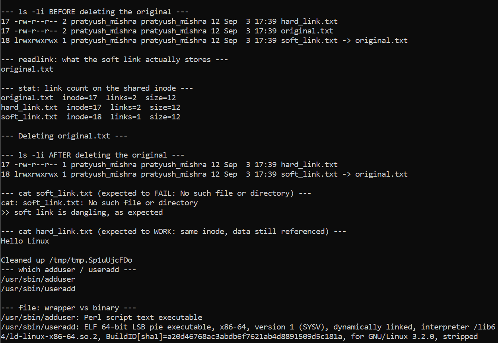
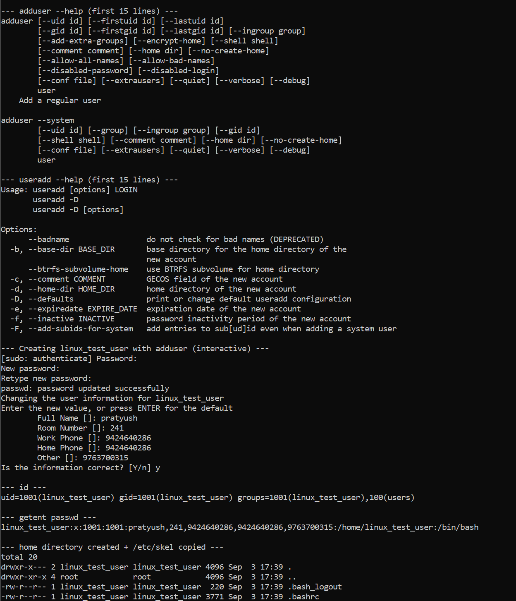
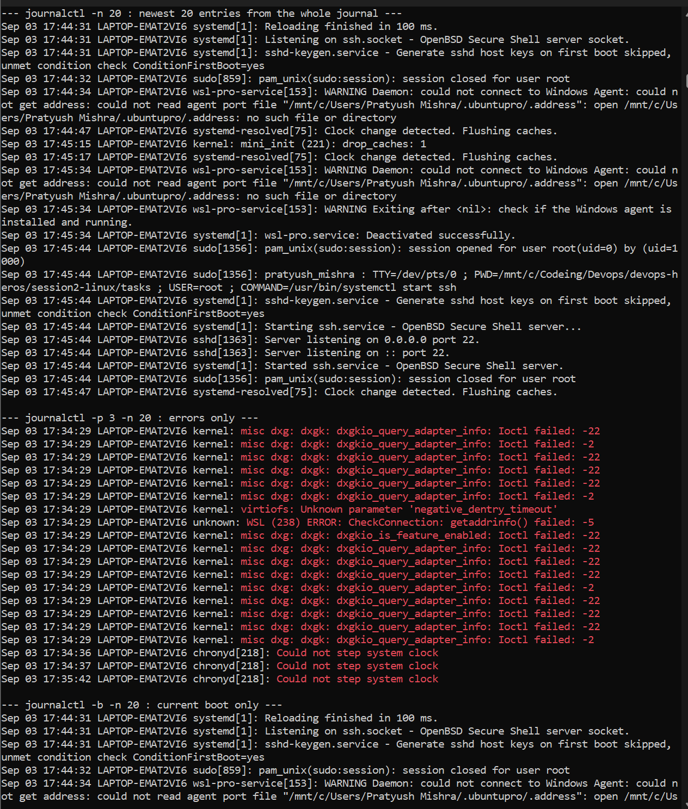
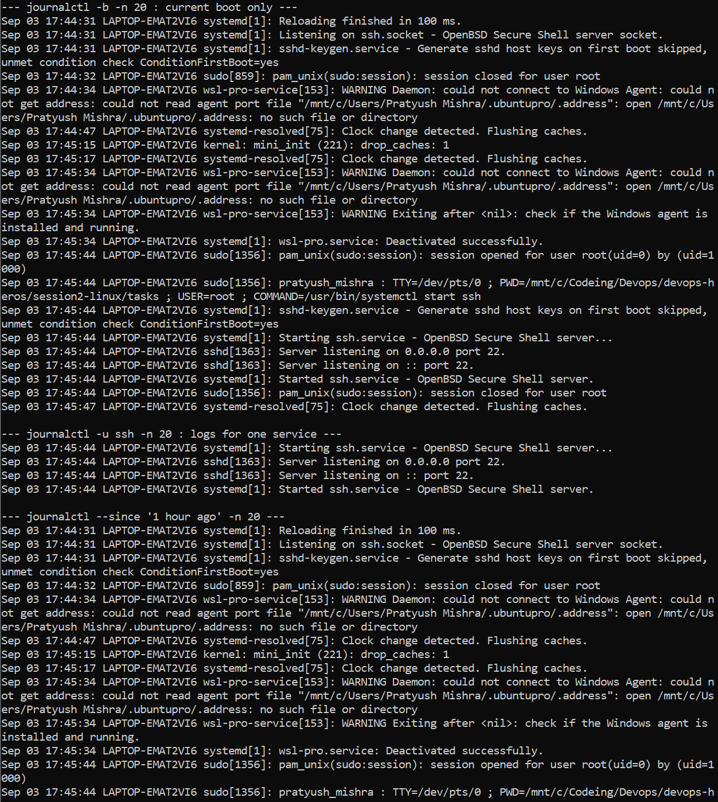
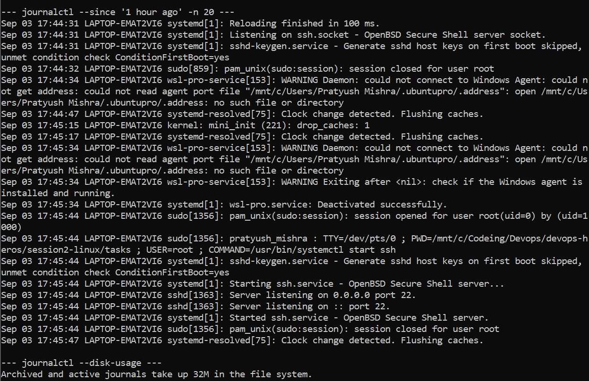
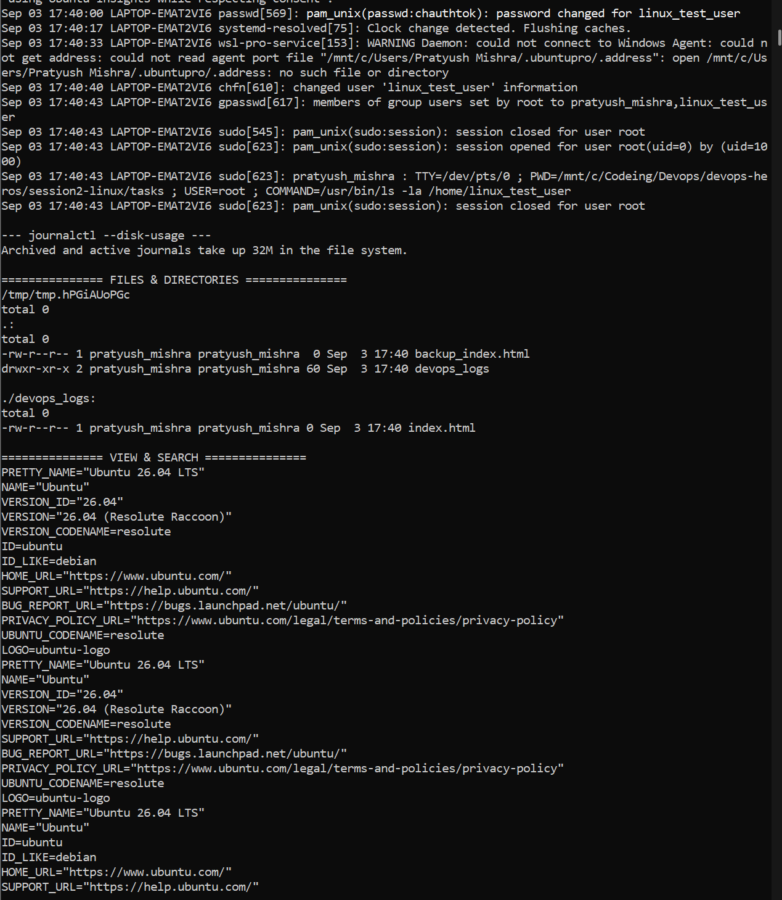
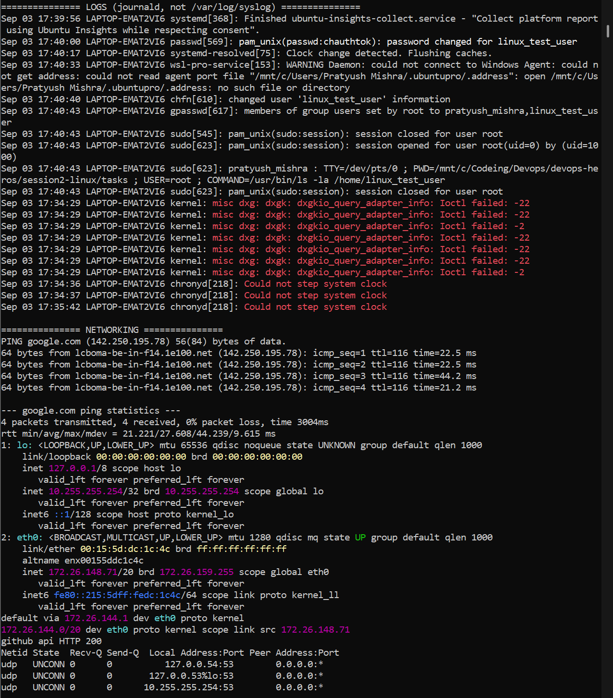
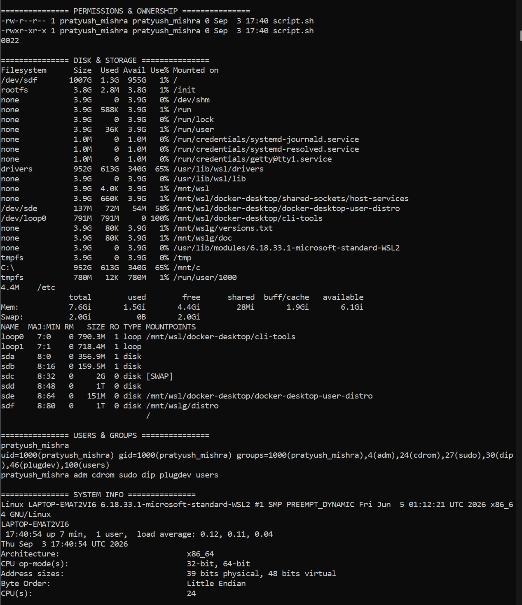

# Session 2 - Linux Fundamentals

**Name:** Pratyush Mishra
**Roll Number:** 10486

Ran all of this on Ubuntu 26.04 in WSL2. Task 3 needs systemd, which WSL doesn't enable by
default, so I turned it on in `/etc/wsl.conf` first. The ssh unit also isn't installed on a
fresh Ubuntu, so I installed `openssh-server` before the per-service log check would show
anything useful.

## Task 1: Soft Link & Hard Link

- Learn the difference between soft links and hard links.
- Learn the commands to create both.
- Practice creating and deleting soft and hard links.
- Prepare for this as an interview question.

## Task 2: adduser vs useradd

- Learn the difference between adduser and useradd.
- Understand which command is preferred on Ubuntu/Linux and why.
- Create a test user using the recommended command.

## Task 3: journalctl

- Learn what journalctl is used for.
- Learn how to view system and service logs using journalctl.
- Practice checking logs for a specific service.

## Task 4: Linux Command Cheat Sheet

- Review the Linux command cheat sheet.
- Practice the important commands covered in the cheat sheet.
- Understand the purpose and basic usage of each command.

---

# Solutions

Scripts in this folder:

| File | Task |
|---|---|
| `task1-links.sh` | Soft link vs hard link |
| `task2-users.sh` | adduser vs useradd |
| `task3-journalctl.sh` | journalctl |
| `task4-cheatsheet.sh` | Linux command cheat sheet |

Run each with `bash task1-links.sh` on an Ubuntu box (VM / EC2 / WSL).
Task 3 needs systemd, so plain WSL without systemd enabled won't work for it.

---

## Task 1 - Soft Link & Hard Link

### The difference

A file's *name* and a file's *data* are two separate things on Linux. The data
lives in an **inode**; a directory entry is just a name pointing at an inode
number.

**Hard link** - a second directory entry pointing at the *same inode*. There is
no "original" and no "copy"; both names are equal, first-class names for one
piece of data. The inode carries a link count, and the data is only freed when
that count hits zero. So deleting one name leaves the other working.

**Soft link (symbolic link)** - a separate file, with its own inode, whose
contents are just a *path string*. Resolving it means following that path. If
the target goes away, the link is left dangling and any read fails with
`No such file or directory`.

| | Hard link | Soft link |
|---|---|---|
| Command | `ln target name` | `ln -s target name` |
| Own inode | No - shares target's | Yes |
| Survives target deletion | Yes | No (dangles) |
| Across filesystems | No | Yes |
| Can link a directory | No (root only, unsafe) | Yes |
| Shows in `ls -l` as | `-` regular file | `l` symlink → target |
| Size | same as file | length of the path string |

### Commands

```bash
echo "Hello Linux" > original.txt
ln -s original.txt soft_link.txt    # soft / symbolic
ln    original.txt hard_link.txt    # hard
ls -li                              # -i shows inode numbers
readlink soft_link.txt              # what path the symlink stores
rm original.txt                     # soft link breaks, hard link keeps working
rm soft_link.txt hard_link.txt      # delete a link = delete just that name
```

### Interview answer, in one line

A hard link is another name for the same inode, so the data survives until the
last name is removed; a symlink is a small file holding a path, so it breaks
when the path stops resolving - but unlike a hard link, it can cross
filesystems and point at directories.

### Output



---

## Task 2 - adduser vs useradd

### The difference

`useradd` is the **low-level binary** from the `shadow-utils` package. It does
exactly what the flags tell it and nothing more: no home directory unless you
pass `-m`, no password set (the account stays locked), no shell unless you pass
`-s`. It is the portable one - present on every distro - and it's what you use
in scripts and configuration management.

`adduser` on Ubuntu/Debian is a **high-level wrapper** around `useradd`. It is
interactive and policy-aware: it picks a UID from the right range, creates the
home directory, copies `/etc/skel`, creates the matching user group, sets the
shell, and prompts for a password and the GECOS fields - one command, sane
defaults.

| | `adduser` | `useradd` |
|---|---|---|
| Type | Perl/shell wrapper (Debian/Ubuntu) | binary, `shadow-utils` |
| Interactive | Yes - prompts | No |
| Creates home dir | Yes, by default | Only with `-m` |
| Copies `/etc/skel` | Yes | Only with `-m` |
| Sets password | Prompts for one | No - account locked |
| On RHEL/CentOS | Usually just a symlink to `useradd` | Native |
| Best for | Humans, one-off admin work | Scripts, automation, Dockerfiles |

### Command choice

I used **`adduser`** to create the test user. On Ubuntu/Debian it's the
recommended command for interactive user creation because it applies the
distro's defaults for you - home directory, skel files, user group, password
prompt - in a single step, where bare `useradd linux_test_user` would leave a
user with no home directory and a locked password. `useradd` is still the right
tool when the account is being created non-interactively by a script.

```bash
sudo adduser linux_test_user            # recommended on Ubuntu
id linux_test_user                      # verify
getent passwd linux_test_user           # account entry

# equivalent with the low-level command:
# sudo useradd -m -s /bin/bash linux_test_user && sudo passwd linux_test_user
```

### Output



---

## Task 3 - journalctl

### What it's for

`journalctl` reads the systemd journal - the binary, indexed log store that
`systemd-journald` writes. On modern Ubuntu (22.04+) it has largely replaced
plain-text `/var/log/syslog`, which is why `tail /var/log/syslog` no longer
works there. Because the journal is structured, you can filter by unit,
priority, boot, and time instead of grepping text.

### Commands used

```bash
journalctl -n 20                   # newest 20 entries
journalctl -f                      # live tail (Ctrl-C to quit)
journalctl -p 3 -n 20              # priority err and worse
journalctl -b                      # current boot only
journalctl -u ssh -n 20            # one service (unit is `sshd` on RHEL)
journalctl --since "1 hour ago"    # time window
journalctl --since "2024-01-01" --until "2024-01-02"
journalctl --disk-usage            # how much space the journal takes
journalctl --vacuum-time=7d        # trim to the last 7 days
```

Priority levels for `-p`: `0 emerg, 1 alert, 2 crit, 3 err, 4 warning, 5 notice,
6 info, 7 debug`.

`--no-pager` is worth adding in scripts, otherwise output opens in `less`.

### Output





---

## Task 4 - Linux Command Cheat Sheet

Commands practised, grouped by area:

| Area | Commands |
|---|---|
| Files & directories | `pwd`, `ls -l`, `mkdir -p`, `touch`, `cp`, `mv`, `rm`, `rmdir` |
| View & search | `cat`, `head -n`, `tail -n`, `grep`, `wc -l`, `find` |
| Logs | `journalctl -n`, `journalctl -p 3` |
| Networking | `ping -c 4`, `ip a`, `ip route`, `curl`, `ss -tuln`, `nslookup` / `dig` |
| Permissions | `chmod 755`, `chown`, `umask`, `ls -l` |
| Disk & storage | `df -h`, `du -sh`, `free -h`, `lsblk` |
| Users & groups | `whoami`, `id`, `groups`, `who`, `last` |
| System info | `uname -a`, `hostname`, `uptime`, `date`, `lscpu` |
| Processes | `ps aux`, `top -b -n 1`, `systemctl list-units` |
| Archives & packages | `tar -czf`, `tar -tzf`, `apt list --installed` |

Three gotchas worth remembering:

- `ping google.com` runs forever - always pass `-c 4` in a script.
- `top` is interactive and blocks - use `top -b -n 1` for one non-interactive pass.
- `/var/log/syslog` is gone on Ubuntu 22.04+ - read logs with `journalctl`.

`ifconfig` and `netstat` are deprecated; `ip` and `ss` are the replacements.

### Output




