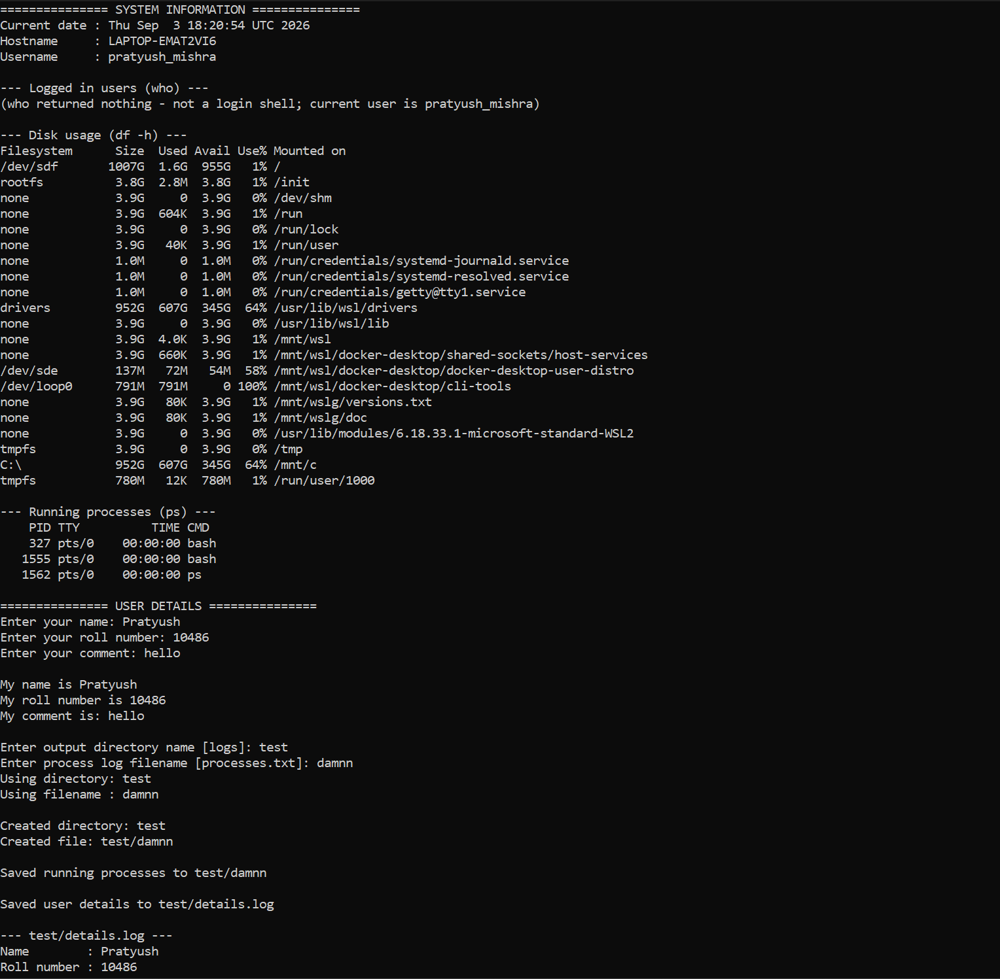
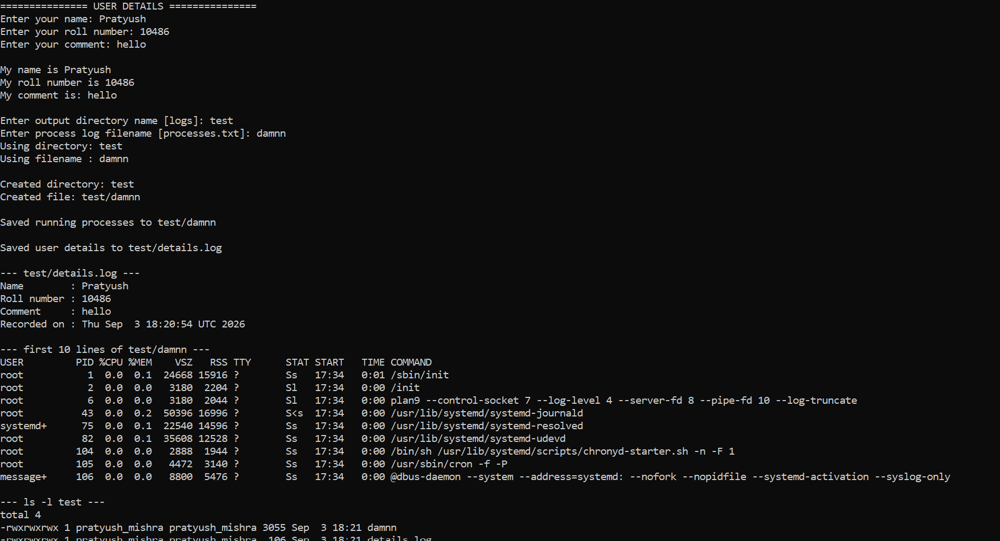

# Session 3 - Shell Scripting

**Name:** Pratyush Mishra
**Roll Number:** 10486

Ran on Ubuntu 26.04 in WSL2. First time through I pressed ENTER at the filename prompt and the
script broke with `Is a directory`, so I added defaults for the blank answers. The explanation
of why that happens is in the notes below.

---

## Task: System Information Script

Write a shell script that:

- Prints the current date.
- Prints the hostname.
- Prints the username.
- Prints the disk usage.
- Prints the running processes.
- Uses variables to store and use data.
- Takes user input using `read -p`.
- Creates a directory using `mkdir`.
- Creates a file using `touch`.
- Stores the running processes information in the file using `>` output redirection.

---

# Solution

Script: [`system-info.sh`](system-info.sh) - run it with `bash system-info.sh`.

## Where each requirement is met

| Requirement | In the script |
|---|---|
| Current date | `current_date=$(date)` |
| Hostname | `host_name=$(hostname)` |
| Username | `user_name=$(whoami)` |
| Disk usage | `df -h` |
| Running processes | `ps` on screen, `ps aux` into the file |
| Variables | `current_date`, `host_name`, `user_name`, `name`, `roll_no`, `comment`, `dir_name`, `file_name`, `details_file` |
| `read -p` | five prompts - name, roll number, comment, directory name, filename |
| `mkdir` | `mkdir -p "$dir_name"` |
| `touch` | `touch "$dir_name/$file_name"` |
| `>` redirection | `ps aux > "$dir_name/$file_name"` |
| `>>` redirection | building `details.log` line by line |
| Default values | `${dir_name:-logs}`, `${file_name:-processes.txt}` |

## The script

```bash
#!/bin/bash

# Variables: command substitution runs once, up front
current_date=$(date)
host_name=$(hostname)
user_name=$(whoami)

echo "Current date : $current_date"
echo "Hostname     : $host_name"
echo "Username     : $user_name"

who          # logged in users
df -h        # disk usage
ps           # running processes

# User input
read -p "Enter your name: "        name
read -p "Enter your roll number: " roll_no
read -p "Enter your comment: "     comment

echo "My name is $name"
echo "My roll number is $roll_no"
echo "My comment is: $comment"

# Create a directory and a file
read -p "Enter output directory name [logs]: " dir_name
read -p "Enter process log filename [processes.txt]: " file_name

# ${var:-default} guards against a blank answer
dir_name="${dir_name:-logs}"
file_name="${file_name:-processes.txt}"

mkdir -p "$dir_name"
touch "$dir_name/$file_name"

# Store process info in the file with >
ps aux > "$dir_name/$file_name"

# Record user details, appending with >>
details_file="$dir_name/details.log"
echo "Name        : $name"    >  "$details_file"
echo "Roll number : $roll_no" >> "$details_file"
echo "Comment     : $comment" >> "$details_file"
```

## Explanation

### Command substitution

`$(date)` runs `date` in a subshell and substitutes its **output** into the assignment, so
`current_date` holds the timestamp as a string. Capturing it once at the top means every later
reference prints the same value - if the script called `date` each time instead, the seconds
would drift between lines. Backticks `` `date` `` do the same thing but don't nest cleanly,
which is why `$( )` is preferred.

### `read -p`

`read -p "prompt" var` prints the prompt on the same line - no separate `echo` needed - and
reads one line of input into `var`. Without `-p` you would have to `echo -n` the prompt first.
The values are then reused by name: `"$dir_name/$file_name"` builds the path from two separate
answers.

### Default values with `${var:-default}`

`read` succeeds even when the user just presses ENTER, leaving the variable set but empty. If
that empty value is then used to build a path, `"$dir_name/$file_name"` collapses to `logs/`  - 
a directory - and the redirection fails with `Is a directory`.

`${file_name:-processes.txt}` expands to the fallback whenever the variable is unset **or**
empty, so a blank answer becomes a sensible default instead of a broken path. The related form
`${var-default}` substitutes only when the variable is entirely unset, which wouldn't catch
this case; `:-` is the one that also covers the empty string.

### Quoting variables

Every expansion is wrapped in double quotes - `"$dir_name/$file_name"`, not
`$dir_name/$file_name`. Unquoted, a name containing a space would be split into two arguments
and the command would operate on the wrong paths.

### `mkdir -p` and `touch`

Plain `mkdir` fails with `File exists` if the directory is already there, which breaks a second
run. `-p` makes it a no-op instead, so the script is safe to re-run. `touch` creates the file
if it's missing and only updates its timestamp if it isn't, so it never destroys content.

### `>` vs `>>`

| Operator | Behaviour |
|---|---|
| `>` | **Overwrites** - truncates the file to zero, then writes |
| `>>` | **Appends** - adds to the end, keeping what is already there |

`ps aux > "$dir_name/$file_name"` uses `>` on purpose: each run should leave one clean snapshot
of the process table rather than a file that grows every time. `details.log` is built with a
single `>` on the first line to reset it, then `>>` for the rest so the earlier lines survive.

### `ps` vs `ps aux`

Bare `ps` lists only processes attached to the current terminal - usually just the shell and
`ps` itself. `ps aux` is the full listing: `a` all users' processes, `u` user-oriented columns
(USER, %CPU, %MEM), `x` including processes with no controlling terminal, such as daemons. The
file gets `ps aux` because that is the useful snapshot.

---

## Output

### Running the script - system information and the prompts



### The files the script created


