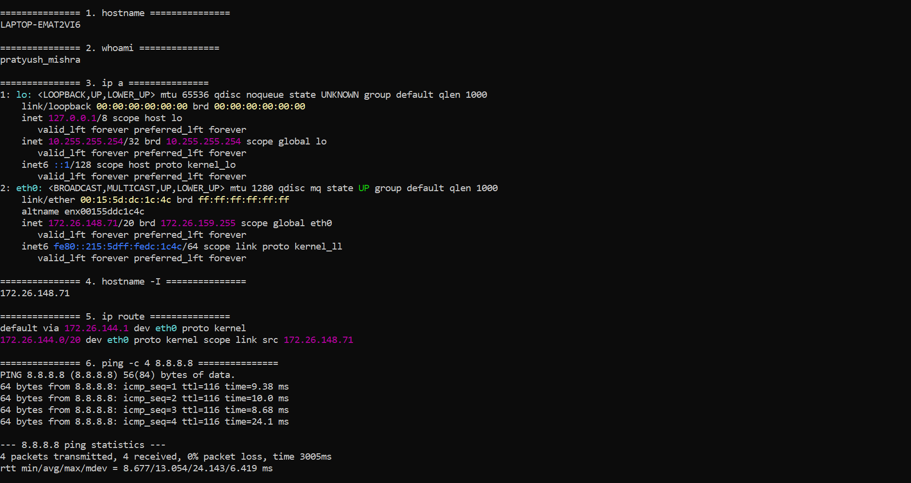
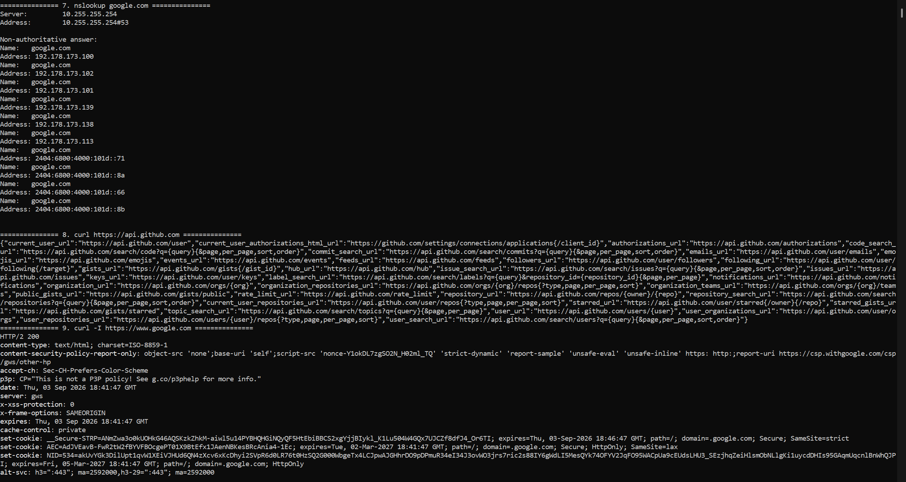
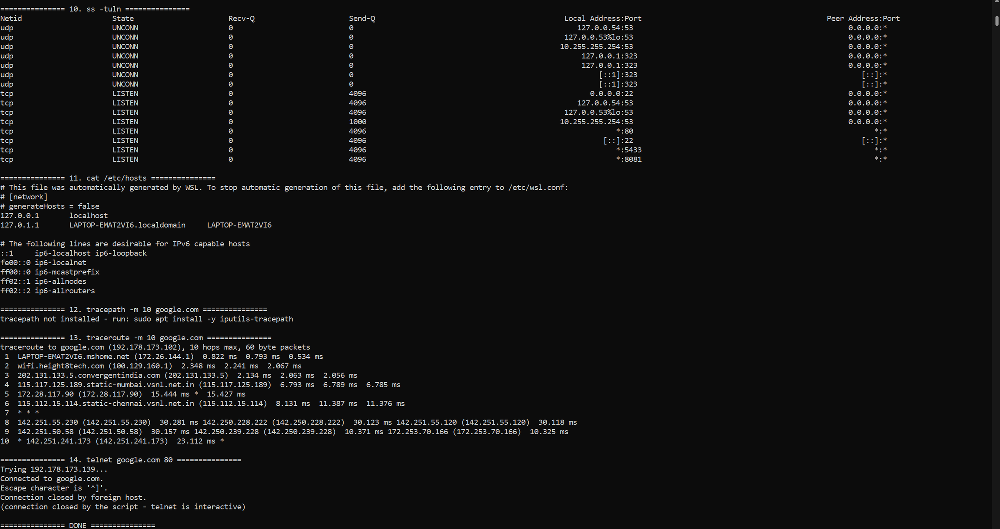
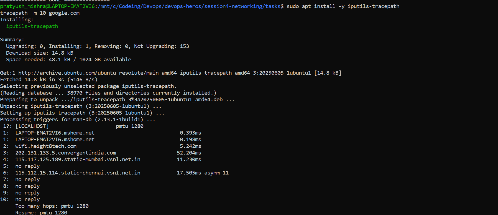

# Session 4 - Networking Fundamentals

**Name:** Pratyush Mishra
**Roll Number:** 10486

Ran on Ubuntu 26.04 in WSL2. Four of the commands need packages Ubuntu doesn't ship, so the
script checks for each one and prints the `apt` line instead of failing. I missed
`iputils-tracepath` on the first pass and had to install it separately.

---

## Task

- Practise the networking commands from the course material.
- Create a Markdown file, run each command and record the output.
- Add a short explanation of what each command does.

Script: [`network-commands.sh`](network-commands.sh) - runs all 14 commands in order.

```bash
# four of these need packages Ubuntu does not ship by default
sudo apt update && sudo apt install -y traceroute iputils-tracepath inetutils-telnet dnsutils
bash network-commands.sh
```

---

# The 14 commands

## 1. `hostname`

Prints the machine's name on the network. It is what appears in shell prompts, log lines and
DNS records. Set at boot from `/etc/hostname`.

## 2. `whoami`

Prints the **effective** username of the current shell. Worth checking before anything
destructive - under `sudo` it prints `root` even though the login user is someone else. The
login user is `logname`; the effective one is what permission checks actually use.

## 3. `ip a`

Lists every network interface with its addresses, MAC, MTU and state. `lo` is the loopback
carrying `127.0.0.1`; `eth0` is the real interface. Replaces the deprecated `ifconfig`.

The flags in angle brackets are the troubleshooting signal: `UP` means administratively
enabled, `LOWER_UP` means there is a live carrier. An interface that is `UP` but not `LOWER_UP`
is configured but unplugged.

`inet 172.26.148.71/20` reads as address plus prefix length - the first 20 bits are the network
portion, so this host sits on `172.26.144.0/20`.

## 4. `hostname -I`

Prints only the IP addresses, one clean line, no interface names. `ip a` is what you read;
`hostname -I` is what you capture into a variable in a script.

## 5. `ip route`

The kernel routing table - how the machine picks where to send a packet.

```
default via 172.26.144.1 dev eth0
172.26.144.0/20 dev eth0 proto kernel scope link src 172.26.148.71
```

The second line is the local network: anything inside `172.26.144.0/20` is on the same link and
goes straight out `eth0`. The `default` line is the fallback for everything else - off to the
gateway. A missing default route is the classic "I can reach my subnet but not the internet"
fault.

## 6. `ping -c 4 8.8.8.8`

Sends ICMP echo requests and times the replies. Tests reachability and latency in one step.

`-c 4` stops after four packets; without it ping runs until Ctrl-C. The `ttl=` in each reply
counts remaining hops - it starts at 64 or 128 and drops by one per router, so a reply with
`ttl=116` crossed roughly 12 routers. `0% packet loss` is what you want; loss without total
failure usually means congestion rather than a broken route.

Note that a host not answering ping isn't proof it's down - plenty of firewalls drop ICMP.

## 7. `nslookup google.com`

Resolves a name to an IP by asking a DNS server, and reports which server answered. Splits
"the site is down" into "DNS is broken" versus "the route is broken": if `nslookup` returns an
address but `ping` to it fails, DNS is fine and the problem is further out.

`dig` gives the same answer with far more detail; `nslookup` is the quick one.

## 8. `curl https://api.github.com`

Fetches a URL and writes the body to stdout. The workhorse for checking whether an HTTP
service is actually serving, not merely listening.

## 9. `curl -I https://www.google.com`

`-I` sends a **HEAD** request - response headers only, no body. Cheap way to check status code,
content type, redirects and cache headers without downloading the page. The first line carries
the status: `200 OK`, `301 Moved Permanently`, `404 Not Found`.

## 10. `ss -tuln`

Lists sockets. `-t` TCP, `-u` UDP, `-l` listening only, `-n` numeric ports rather than service
names. Answers "is anything actually bound to this port".

The `Local Address:Port` column matters: `0.0.0.0:22` accepts connections from anywhere, while
`127.0.0.1:5432` accepts only from the machine itself - a database bound to loopback is
unreachable from another host no matter how open the firewall is. `ss` replaces `netstat`.

## 11. `/etc/hosts`

A static name-to-IP file the resolver consults **before** DNS. Always contains
`127.0.0.1 localhost`. Useful to point a hostname at a test server, and the first place to look
when one machine resolves a name differently from every other machine.

## 12. `tracepath -m 10 google.com`

Traces the route to a destination hop by hop and reports the MTU along the way. No root needed,
which is why it's often available where `traceroute` isn't. `-m 10` caps the hop count.

In the run below it reports `pmtu 1280`, which matches the `mtu 1280` on `eth0` in the `ip a`
output - WSL2's NAT interface uses a smaller MTU than the usual 1500 on physical Ethernet. That
is the path MTU: the largest packet that can cross the whole route without fragmentation.

`no reply` on several hops means those routers didn't answer, which is normal - many are
configured not to respond to the probes. `asymm 11` on hop 6 means the return path took a
different number of hops than the outbound one, so the round trip isn't symmetric. Hitting
`Too many hops` at 10 is just the `-m 10` cap, not a failure.

## 13. `traceroute -m 10 google.com`

Same idea, more control. Works by sending packets with a deliberately small TTL - TTL 1 expires
at the first router, which replies with "time exceeded" and so reveals itself; TTL 2 exposes
the second, and so on. Rows of `* * *` mean a hop didn't reply, which is usually a router
configured not to, not a failure.

Where the trace stops tells you where connectivity breaks.

## 14. `telnet google.com 80`

Opens a raw TCP connection to a host and port. Not for logging in - telnet is unencrypted and
obsolete for that - but still the fastest way to answer "is this port reachable from here".
`Connected to ...` means open; `Connection refused` means reachable-but-nothing-listening; a
hang means a firewall is dropping packets silently.

In the script the session is closed immediately with `</dev/null` because telnet is
interactive. Interactively you exit with `Ctrl-]` then `quit`.

---

# IP addressing notes

## Address classes

| Class | First octet | Default mask | Network / host bits |
|---|---|---|---|
| A | 1 - 127 | `255.0.0.0` (`/8`) | 8 / 24 |
| B | 128 - 191 | `255.255.0.0` (`/16`) | 16 / 16 |
| C | 192 - 223 | `255.255.255.0` (`/24`) | 24 / 8 |
| D | 224 - 239 | - | multicast |
| E | 240 - 255 | - | experimental |

## Subnet mask

An IPv4 address is 32 bits. The mask marks which leading bits are the **network** part; the
rest identify the **host** inside that network. `/8` means 8 network bits and 24 host bits.

Host count for `n` host bits is `2^n`, and usable hosts are `2^n − 2` - the all-zeros address
names the network itself and the all-ones address is the broadcast, so neither can be assigned.

For `120.27.1.0/8`: 24 host bits → `2^24 = 16,777,216` addresses → `16,777,214` usable.
For `197.23.45.10` with `255.255.255.0`: 8 host bits → 256 addresses → 254 usable, network
`197.23.45.0`, broadcast `197.23.45.255`.

## Private ranges

| Class | Range |
|---|---|
| A | `10.0.0.0` - `10.255.255.255` |
| B | `172.16.0.0` - `172.31.255.255` |
| C | `192.168.0.0` - `192.168.255.255` |

Private addresses are not routed on the public internet; a NAT gateway translates them on the
way out. The WSL interface above sits in `172.26.144.0/20`, inside the class B private range.

## Special addresses

- `127.0.0.1` - loopback, the machine talking to itself. The whole `127.0.0.0/8` block is reserved.
- `0.0.0.0` - "any address"; as a bind address it means every interface.
- `255.255.255.255` - limited broadcast.

---

## Output

### Commands 1-6: hostname, whoami, ip a, hostname -I, ip route, ping



### Commands 7-9: nslookup, curl, curl -I



### Commands 10-14: ss, /etc/hosts, tracepath, traceroute, telnet



### tracepath


