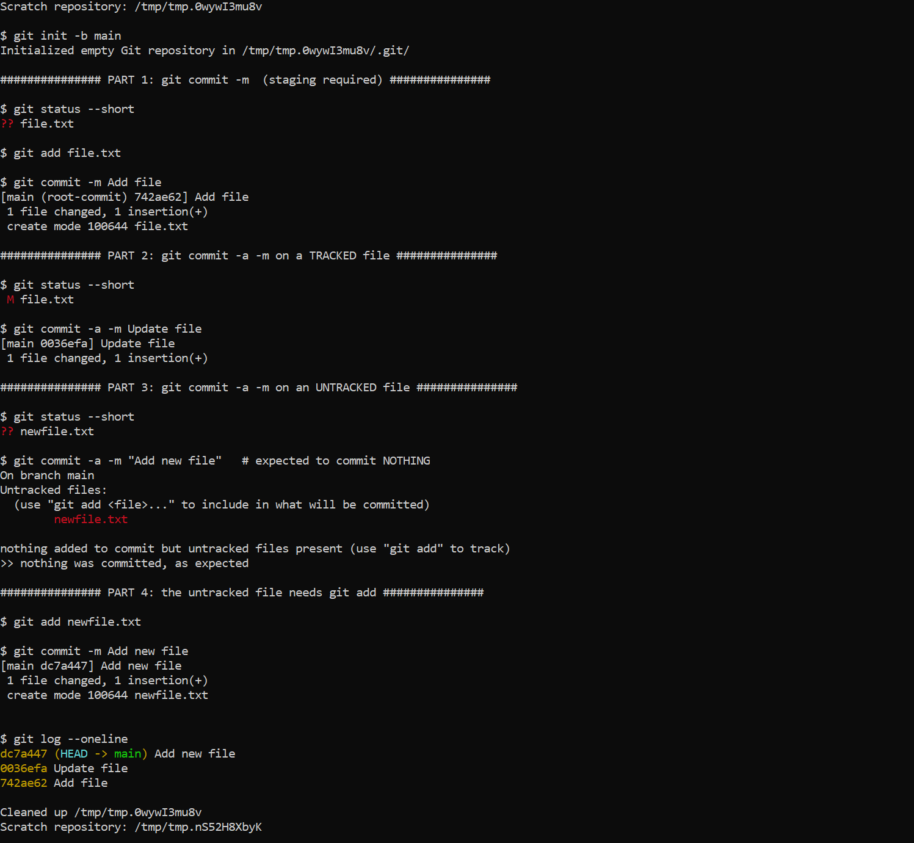
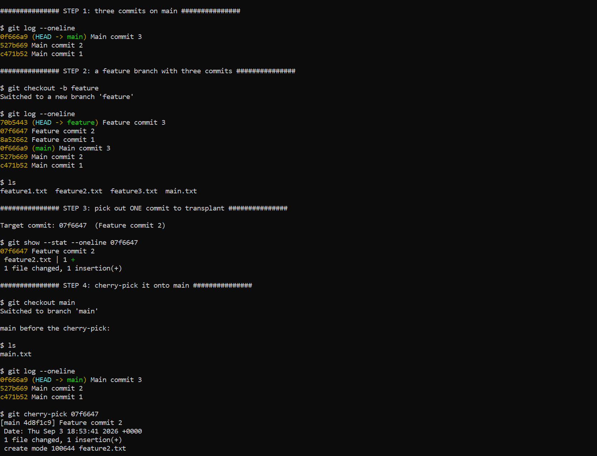
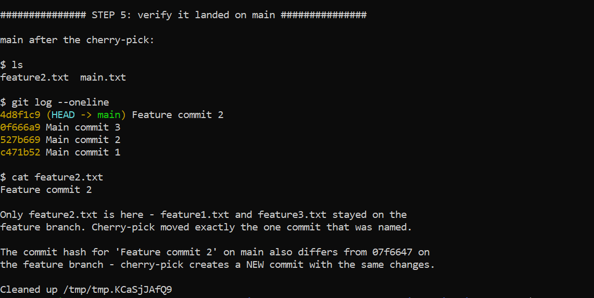

# Session 5 - Git & GitHub

**Name:** Pratyush Mishra
**Roll Number:** 10486

Ran on Ubuntu 26.04 in WSL2. Both scripts build a throwaway repo under `/tmp` so nothing
touches my real checkouts. My first version of the cherry-pick task failed with a
`modify/delete` conflict; working out why taught me more than the clean run did, so I've kept
the explanation in.

---

## Tasks

### Task 1: `git commit -a -m` vs `git commit -m`
- Practise `git commit -a -m "message"`.
- Understand how it differs from `git commit -m "message"`.
- Run both and observe where they behave differently.

### Task 2: Git Cherry-Pick
- Create 2-4 commits on the `main` branch.
- Use `git log` to view them.
- Create a new branch and make 2-3 commits there.
- Use `git log` to identify one specific commit.
- Cherry-pick just that commit onto `main`.
- Verify the change is now present on `main`.

Scripts: [`task1-commit-flags.sh`](task1-commit-flags.sh),
[`task2-cherry-pick.sh`](task2-cherry-pick.sh). Both build a throwaway repository
under `/tmp`, set a local identity so the global git config is untouched, and clean
up after themselves.

```bash
bash task1-commit-flags.sh
bash task2-cherry-pick.sh
```

---

# Task 1 - `git commit -a -m` vs `git commit -m`

## The three areas

Git moves a change through three places, and the two commit forms differ only in whether they
handle the middle step for you:

| Area | What lives there | How a change gets there |
|---|---|---|
| Working directory | the files you edit | you edit them |
| Staging area (index) | what the next commit will contain | `git add` |
| Repository | permanent history | `git commit` |

`git commit -m "msg"` commits **only what is already staged**. Anything modified but not
`git add`-ed is left behind in the working directory.

`git commit -a -m "msg"` does one extra thing first: it automatically stages every file git is
**already tracking** that has been modified or deleted, then commits.

## The limit that matters

`-a` means "all *tracked* files", not "all files". A file git has never seen - one that has
never been committed - is **untracked**, and `-a` skips it completely:

```bash
echo "New file" > newfile.txt
git commit -a -m "Add new file"
# On branch main
# Untracked files:
#   newfile.txt
# nothing added to commit but untracked files present
```

A brand new file always needs an explicit `git add` first, whichever commit flag you use. The
script demonstrates exactly this: `file.txt` is committed with `-a` without any `git add`
because it was already tracked, while `newfile.txt` in the very next step is ignored by `-a`
and has to be staged by hand.

## Summary

| | `git commit -m` | `git commit -a -m` |
|---|---|---|
| Commits staged changes | yes | yes |
| Auto-stages modified tracked files | no | yes |
| Auto-stages deleted tracked files | no | yes |
| Picks up untracked (new) files | no | **no** |
| Needs `git add` for a new file | yes | yes |

`-a` is a convenience for the common "I edited files that already exist" case. It is worth
being deliberate about, because staging selectively is how you split unrelated edits into
separate commits - `-a` gives that up by sweeping everything modified into one.

## Output



---

# Task 2 - Git Cherry-Pick

## What cherry-pick does

`git cherry-pick <commit>` takes the **changes introduced by one commit** and replays them as a
new commit on the branch you are currently on. It is the tool for "I need that one fix from the
other branch, not the rest of it" - a hotfix that has to reach `main` before the feature it
lives in is finished.

`git merge` brings across a whole branch and its history. `cherry-pick` brings across exactly
the commits you name and nothing else.

## What the script does

1. Three commits on `main`, writing to `main.txt`.
2. A `feature` branch with three commits of its own, each creating its **own** file  - 
   `feature1.txt`, `feature2.txt`, `feature3.txt`.
3. `git log --format='%h %s'` finds the hash of **Feature commit 2** - deliberately the middle
   one, so it's obvious that only that commit moves and not the ones around it.
4. `git checkout main`, then `git cherry-pick <hash>`.
5. `git log --oneline`, `ls` and `cat feature.txt` confirm the change is on `main`.

## The hash changes

After the cherry-pick, `Feature commit 2` appears in `main`'s log with a **different hash** from
the one on `feature`. A commit's hash is derived from its content *and* its metadata - parent
commit, author, timestamp, message. The replayed commit has a different parent, so it's a
different commit object even though the diff it applies is identical.

After the pick, `main` holds `feature2.txt` and nothing else from the branch - `feature1.txt`
and `feature3.txt` stayed behind. Cherry-pick moved exactly the commit that was named.

## Why each feature commit needs its own file

This detail is worth understanding, because getting it wrong produces a conflict that looks
mysterious. A first attempt had all three feature commits appending to one shared
`feature.txt`, and cherry-picking the middle commit failed:

```text
CONFLICT (modify/delete): feature.txt deleted in HEAD and modified in df69d1e
error: could not apply df69d1e... Feature commit 2
```

A commit stores a **diff against its parent**, not a whole file. "Feature commit 2" was the diff
*append a line to an existing feature.txt* - and the commit that created that file was
"Feature commit 1", which wasn't being picked. On `main` the file didn't exist at all, so git
saw a change to a file that isn't there and stopped. `modify/delete` is exactly that message:
modified in the commit being picked, absent in `HEAD`.

General rule: a commit is only safely cherry-pickable if the state it depends on already
exists on the target branch. Give each commit an independent file and the dependency
disappears.

## When it conflicts

Where changes genuinely overlap, the cherry-pick stops with a conflict, exactly like a merge.
The recovery is the same three options:

```bash
# fix the conflict markers, then
git add <file>
git cherry-pick --continue

git cherry-pick --abort     # give up, return to the pre-pick state
git cherry-pick --skip      # skip this commit, useful mid-range
```

`git cherry-pick A..B` picks a range, and `-n` (`--no-commit`) applies the changes to the
working tree and stages them without committing, so you can combine several picks into one
commit.

## Output




