# Session 6 - Docker Fundamentals

**Name:** Pratyush Mishra
**Roll Number:** 10486

Ran on Ubuntu 26.04 in WSL2 with Docker Desktop. I first had to enable WSL integration for the
Ubuntu distro, otherwise the docker CLI can't reach the daemon at all. My first run also
collided with a container I already had on port 8081, which is why these use 8091-8096 and
why the script now checks the port before starting anything.

---

## Task: Hello World Applications

Build a simple Hello World web application with Docker for each of the following, giving each
its own folder, its own application code and its own Dockerfile:

- Node.js application
- Python application
- Java application
- Apache web server
- React application
- Nginx application

For every one of them the image has to be built, a container run from it, and the Hello World
page confirmed in a browser.

---

## The six applications

Each app has its own folder with its source and `Dockerfile`. Every app is given a **different
host port**, so all six run at the same time - one `docker ps` shows every container and all
six pages can be opened side by side.

| Folder | Base image | Image tag | Container | Port mapping | URL |
|---|---|---|---|---|---|
| [`node-app`](node-app/) | `node:24-alpine` | `node-webapp` | `node-container` | `8091:8080` | http://localhost:8091 |
| [`python-app`](python-app/) | `python:3.12-slim` | `python-webapp` | `python-container` | `8092:8080` | http://localhost:8092 |
| [`java-app`](java-app/) | `eclipse-temurin:21-jdk` | `java-webapp` | `java-container` | `8093:8080` | http://localhost:8093 |
| [`apache-app`](apache-app/) | `httpd:latest` | `apache-webapp` | `apache-container` | `8094:80` | http://localhost:8094 |
| [`react-app`](react-app/) | `node:24-alpine` → `nginx:latest` | `react-webapp` | `react-container` | `8095:80` | http://localhost:8095 |
| [`nginx-app`](nginx-app/) | `nginx:latest` | `nginx-webapp` | `nginx-container` | `8096:80` | http://localhost:8096 |

## Running everything

```bash
bash build-and-run-all.sh   # builds all six images, runs all six containers
bash cleanup.sh             # stops and removes them
```

---

## Two kinds of application

The six split into two groups, and the split explains why the Dockerfiles look so different.

**Application servers** - Node.js, Python and Java each *run a process* that listens on a port.
The image needs a language runtime, and `CMD` starts the server. The container is alive for as
long as that process is.

**Web servers serving static files** - Apache and Nginx don't run any of your code. The image
is the server plus an `index.html` copied into the right directory, and the base image's own
`CMD` starts it. Nothing to write beyond the HTML.

React sits across the split: JSX never reaches the browser, so it needs Node at **build** time
to compile and Nginx at **run** time to serve. That's a multi-stage build, and it means the
final image contains no Node at all.

---

## 1. node-app

**Files:** `server.js` (Express, one route), `package.json`, `Dockerfile`

```dockerfile
FROM node:24-alpine
WORKDIR /app
COPY package.json ./
RUN npm install
COPY server.js ./
EXPOSE 8080
CMD ["npm", "start"]
```

`package.json` is copied on its own, *before* the source. Docker caches each instruction as a
layer and reuses it while its inputs are unchanged, so editing `server.js` invalidates only the
last two layers - `npm install` isn't re-run. Copying everything at once would reinstall the
dependency tree on every code change.

## 2. python-app

**Files:** `app.py` (Flask, one route), `requirements.txt`, `Dockerfile`

Same layer-caching split: `requirements.txt` then `pip install`, source afterwards.

The one thing that will silently break a containerised web app:

```python
app.run(host="0.0.0.0", port=8080)
```

Flask defaults to `127.0.0.1`, which inside a container means "only reachable from inside this
container". The port mapping would look correct and the page would still refuse to load.
`0.0.0.0` binds every interface, which is what makes `-p` work.

## 3. java-app

**Files:** `Main.java`, `Dockerfile`

```dockerfile
CMD ["java", "Main.java"]
```

No `javac`, no build tool, no `.class` files. Java 11 onwards can run a single source file
directly, compiling it in memory. `com.sun.net.httpserver.HttpServer` ships with the JDK, so
this app has no external dependencies at all.

## 4. apache-app

**Files:** `index.html`, `Dockerfile`

```dockerfile
FROM httpd:latest
COPY index.html /usr/local/apache2/htdocs/index.html
EXPOSE 80
```

Two lines. `htdocs` is Apache's document root in the official image, and the base image already
defines the `CMD` that starts httpd - no need to repeat it.

## 5. react-app

**Files:** `src/App.jsx`, `src/main.jsx`, `index.html`, `vite.config.js`, `package.json`,
`.dockerignore`, `Dockerfile`

```dockerfile
FROM node:24-alpine AS builder
WORKDIR /app
COPY package.json ./
RUN npm install
COPY vite.config.js index.html ./
COPY src ./src
RUN npm run build

FROM nginx:latest
COPY --from=builder /app/dist /usr/share/nginx/html
EXPOSE 80
```

The browser can't run JSX, so vite compiles it to plain HTML, CSS and JavaScript in `dist/`.
Only `dist/` crosses into the second stage via `COPY --from=builder`. `node_modules` and the
whole build toolchain stay behind in the builder stage and never reach the shipped image.

`.dockerignore` keeps a local `node_modules` from being uploaded into the build context - that
would be slow and pointless, since `npm install` runs inside the image anyway.

## 6. nginx-app

**Files:** `index.html`, `Dockerfile`

Same shape as Apache, different document root: `/usr/share/nginx/html`.

---

## Port mapping

`-p 8091:8080` means **host port : container port**. The left number is what you type in the
browser; the right is what the process inside the container is listening on.

If another container on the machine already publishes a host port, `docker run` fails and the
port stays bound to whatever was there first - so a later `curl` against it quietly reaches the
*other* service rather than reporting an error. The script now checks each host port with `ss`
before starting and skips the app with a clear message instead.

The container ports differ by app - `8080` for the three application servers, `80` for the
three web servers, since that is the port their base images already listen on. Host ports are
`8091`-`8096` purely so all six can run at once. Two containers can't share a host port, which
is why running these on one port would mean starting and stopping them one at a time.

---

## Output

### Building and running all six

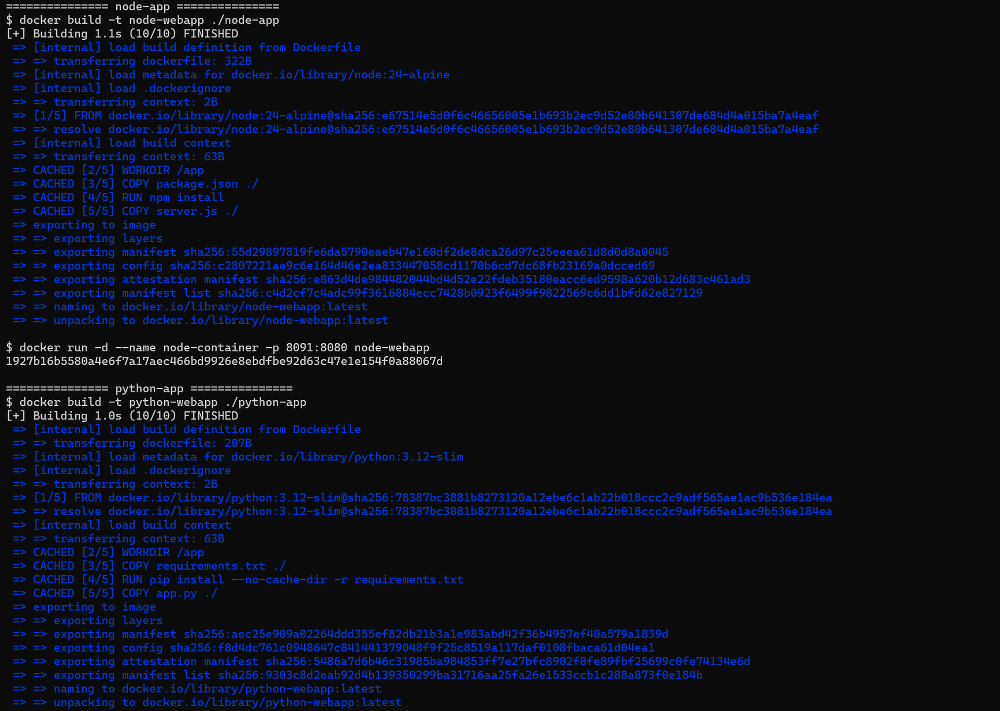

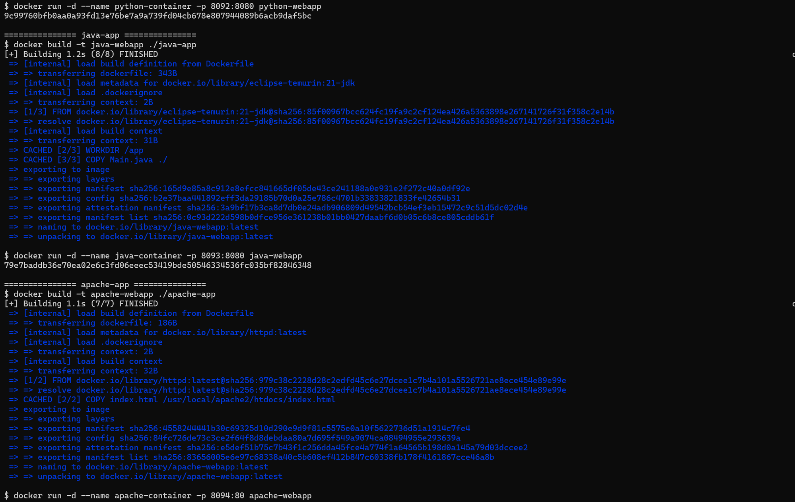

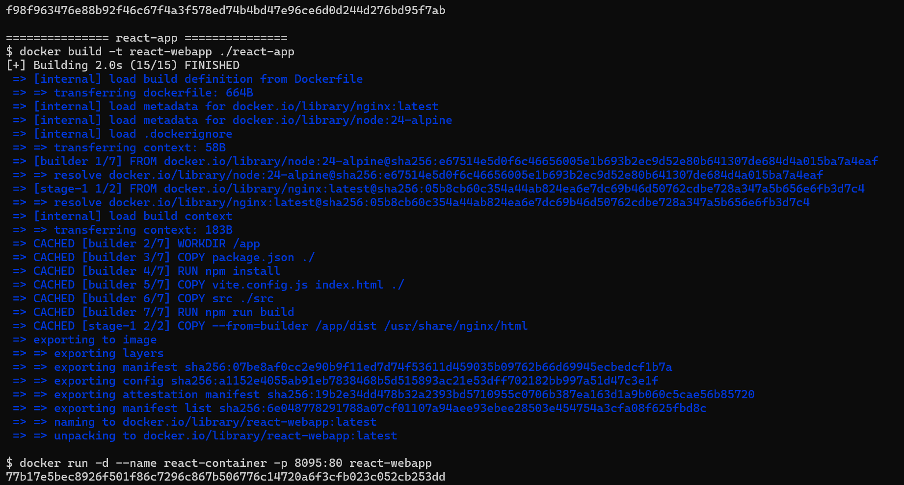

### `docker ps` - all six containers running

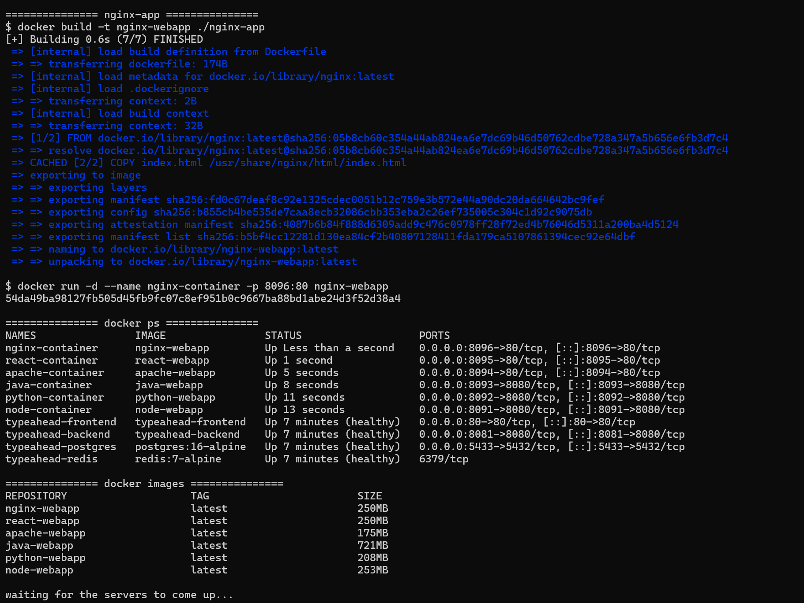

### `curl` against each application

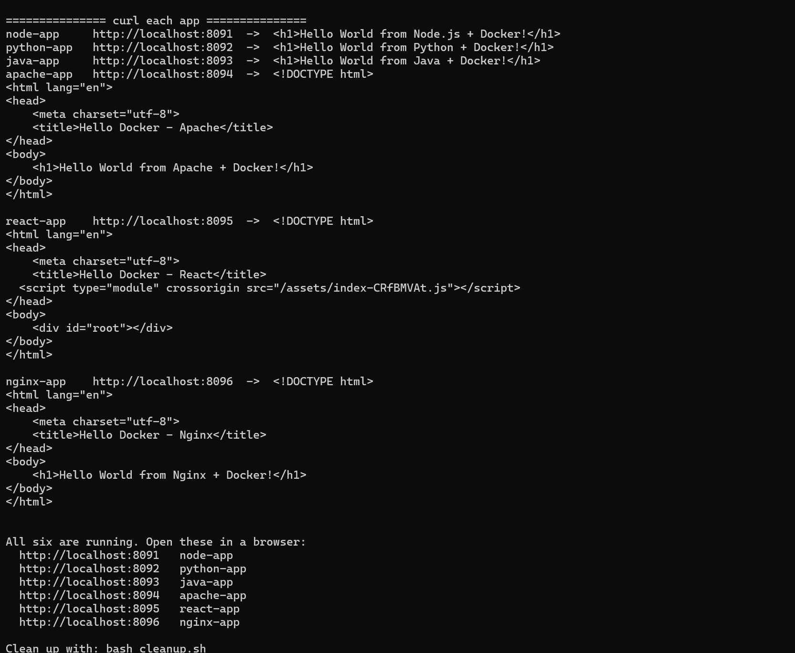

### The six pages in a browser

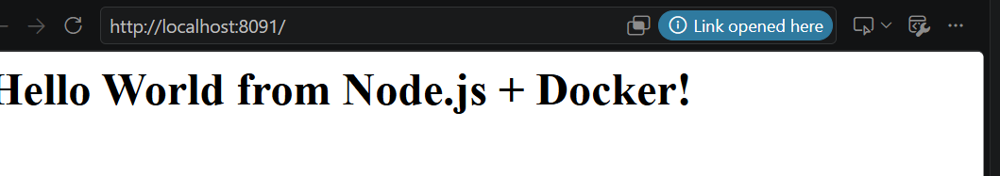

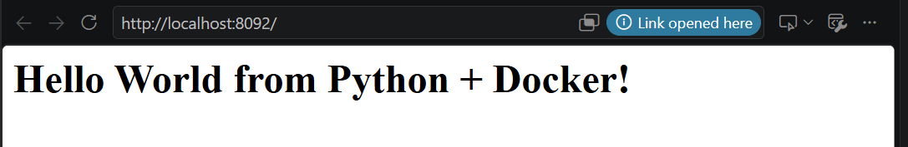

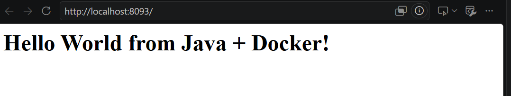

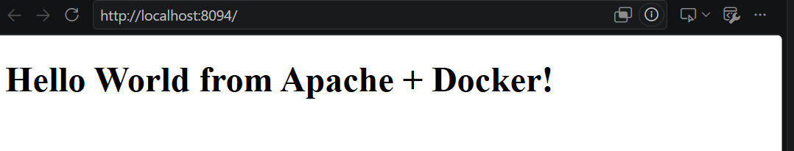

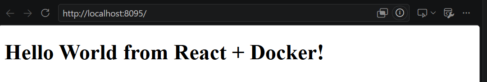

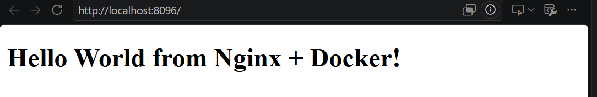
