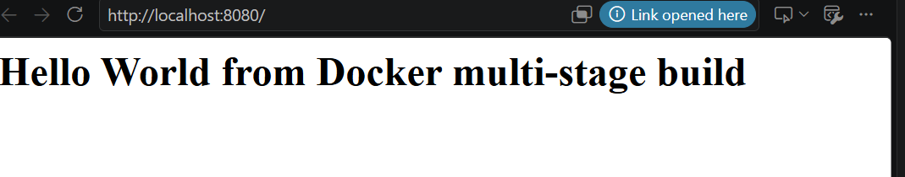
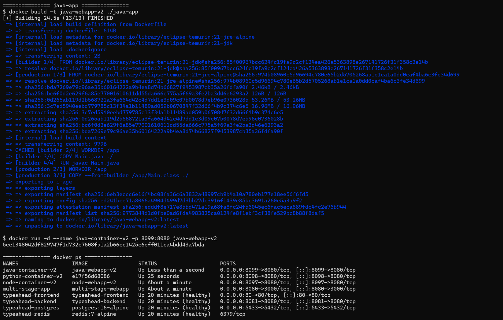
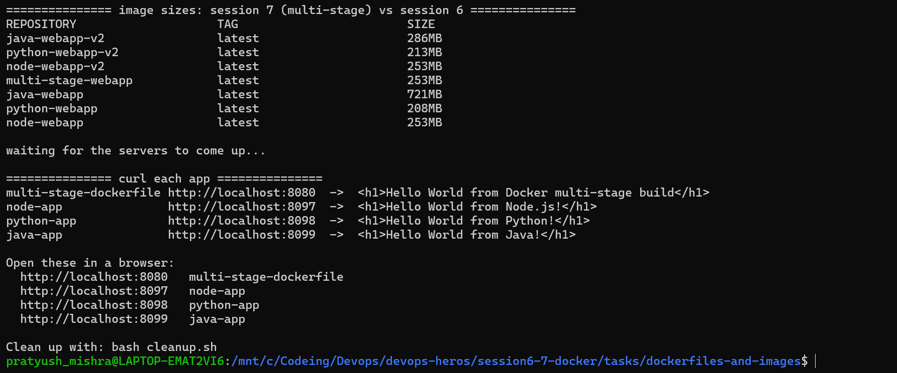
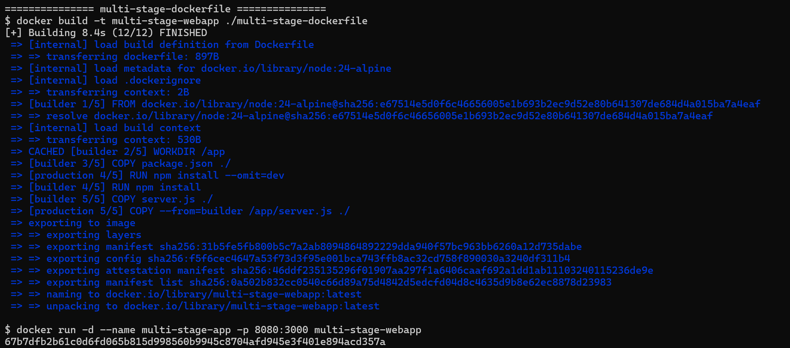
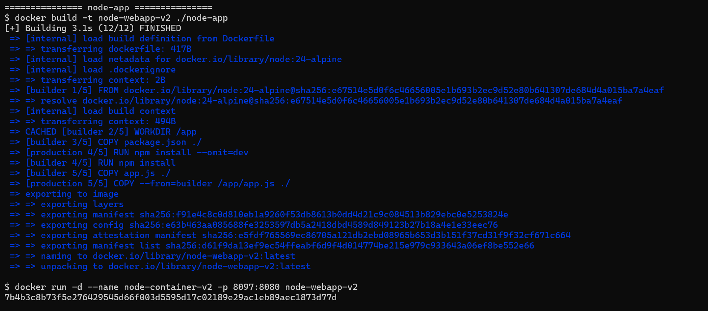
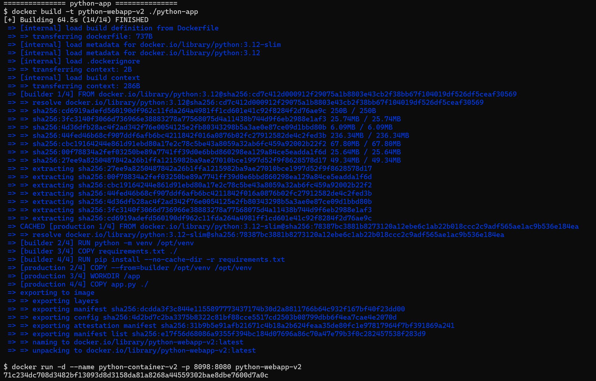
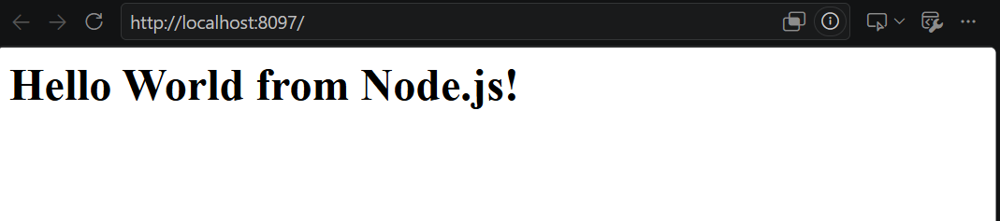
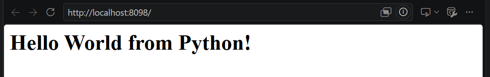
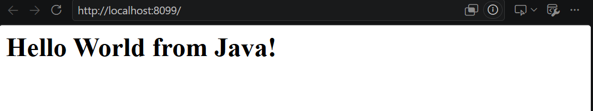

# Session 7 - Dockerfiles & Images (Multi-Stage Build)

**Name:** Pratyush Mishra
**Roll Number:** 10486

Ran on Ubuntu 26.04 in WSL2 with Docker Desktop. The image sizes in Task 2 are measured from
my own builds against the session 6 images, and they didn't come out the way I expected -
only one of the three actually got smaller. I've written up what the numbers show rather than
what I assumed they would.

---

## Tasks

### Task 1: Run Multi-Stage Dockerfile
- Build the Docker image using the multi-stage Dockerfile.
- Run a container from the image.
- Access the application running inside the container.
- Verify it displays `Hello World from Docker multi-stage build`.
- Verify the running container using `docker ps`.
- Confirm the application is reachable on port `8080`.

### Task 2: Documentation
- Document the running application and the `docker ps` output.

### Task 3: Docker Application Deployment
- Deploy at least 3 different types of applications using Docker.

```bash
bash build-and-run-all.sh   # builds and runs all four
bash cleanup.sh             # removes them
```

---

# Task 1 - Multi-Stage Dockerfile

Folder: [`multi-stage-dockerfile`](multi-stage-dockerfile/) - `server.js`, `package.json`,
`Dockerfile`.

```dockerfile
FROM node:24-alpine AS builder
WORKDIR /app
COPY package.json ./
RUN npm install
COPY server.js ./

FROM node:24-alpine AS production
WORKDIR /app
COPY package.json ./
RUN npm install --omit=dev
COPY --from=builder /app/server.js ./
EXPOSE 3000
CMD ["npm", "start"]
```

## How a multi-stage build works

A Dockerfile can contain several `FROM` instructions. Each one starts a **new stage** with a
fresh filesystem, and `AS <name>` gives that stage a label. Only the **last** stage becomes the
image that gets tagged and shipped - every earlier stage is discarded once the build finishes.

`COPY --from=builder /app/server.js ./` is the bridge: it reaches into a previous stage and
lifts out specific files. That's the whole mechanism. Everything the builder installed,
compiled or downloaded stays behind unless it's explicitly copied forward.

The `builder` stage here installs the complete dependency tree, including anything needed only
at build time. `production` starts clean, installs runtime dependencies only with
`--omit=dev`, and takes just `server.js` across.

## Why it matters

Without stages, every `RUN` leaves a layer in the final image. Deleting files in a later layer
doesn't shrink the image - the earlier layer still holds them, and anyone who pulls the image
can recover them. That applies to build secrets too: an API token used during a build stays in
the layer history even if a later step removes the file.

A second stage sidesteps all of it. The build tools were never in the final image to begin
with, so there isn'thing to clean up and nothing to leak.

## Commands

The app listens on port `3000` inside the container, published on host port `8080` as the task
requires:

```bash
docker build -t multi-stage-webapp ./multi-stage-dockerfile
docker run -d --name multi-stage-app -p 8080:3000 multi-stage-webapp
docker ps
curl -s http://localhost:8080
```

---

# Task 2 - Documentation

## The application running

The page served at `http://localhost:8080` shows the required text.



## `docker ps` showing the container on port 8080



The `PORTS` column reads `0.0.0.0:8080->3000/tcp` - host `8080` forwards to container `3000`,
which is where the Express server is listening. The two numbers are deliberately different to
make the mapping visible: nothing in the image knows or cares about `8080`.

## Image sizes - single-stage vs multi-stage

Comparing these images against the equivalent single-stage builds from session 6:

| Application | Session 6 (single-stage) | Session 7 (multi-stage) | Change |
|---|---|---|---|
| Node.js | `node-webapp` 253MB | `node-webapp-v2` 253MB | no change |
| Python | `python-webapp` 208MB | `python-webapp-v2` 213MB | **+5MB - larger** |
| Java | `java-webapp` 721MB | `java-webapp-v2` 286MB | **−435MB, 2.5× smaller** |



The result isn't what "multi-stage makes images smaller" would lead you to expect, and the
split is the interesting part.

**Java saves enormously.** Session 6 shipped `eclipse-temurin:21-jdk` - a full JDK on a Debian
base, carrying `javac` and the entire development toolchain into production even though the
running app needs none of it. Session 7 compiles in a JDK stage and ships only the `.class`
file on `eclipse-temurin:21-jre-alpine`: a JRE, on Alpine, with no compiler at all. Two things
are being dropped at once - the compiler, and the Debian userland underneath it.

**Node saves nothing.** 253MB either way. The app's only dependency is Express, which is
runtime, not build-time. There were no dev dependencies to omit and no build step to leave
behind, so the second stage reproduces the first almost exactly.

**Python comes out 5MB *larger*.** Both images end on `python:3.12-slim`, so the base is
identical. The multi-stage version copies a whole virtualenv, which duplicates a little of what
the interpreter already provides, and that overhead exceeds what was saved by not carrying pip
build artefacts.

The point is about *why* multi-stage helps, not that it always does. The saving comes from
**leaving behind a build toolchain that the running program doesn't need** - a compiler, a
bundler, a package builder. A compiled language has one, so Java wins. Interpreted languages
must ship their runtime by definition, so there is little to leave behind and the pattern earns
its keep only when there is a genuine build step. The React app in session 6 is the
counter-example on the interpreted side: vite is a real build step, so its multi-stage build
keeps `node_modules` and the whole toolchain out of a final image that is just nginx and static
files.

Adding stages to a Dockerfile that has nothing to discard buys complexity and no bytes.

---

# Task 3 - Docker Application Deployment

Three different application types, each with its own folder, Dockerfile, image and container.
All three use multi-stage builds.

| Folder | Build stage | Runtime stage | Image | Container | Port |
|---|---|---|---|---|---|
| [`node-app`](node-app/) | `node:24-alpine` | `node:24-alpine` | `node-webapp-v2` | `node-container-v2` | `8097:8080` |
| [`python-app`](python-app/) | `python:3.12` | `python:3.12-slim` | `python-webapp-v2` | `python-container-v2` | `8098:8080` |
| [`java-app`](java-app/) | `eclipse-temurin:21-jdk` | `eclipse-temurin:21-jre-alpine` | `java-webapp-v2` | `java-container-v2` | `8099:8080` |

## 1. node-app

Builder resolves the full dependency tree; the runtime stage reinstalls with `--omit=dev` and
takes only `app.js` across. Dev dependencies never reach the shipped image.

## 2. python-app

```dockerfile
FROM python:3.12 AS builder
RUN python -m venv /opt/venv
ENV PATH="/opt/venv/bin:$PATH"
COPY requirements.txt ./
RUN pip install --no-cache-dir -r requirements.txt

FROM python:3.12-slim AS production
COPY --from=builder /opt/venv /opt/venv
ENV PATH="/opt/venv/bin:$PATH"
```

The build stage uses the **full** `python:3.12` image because some packages compile C
extensions during `pip install` and need gcc. The runtime uses `python:3.12-slim`, which has no
compilers at all.

A virtualenv is a self-contained directory, so copying `/opt/venv` across is enough to bring
the installed packages with it - no second `pip install` in the runtime stage. Setting `PATH`
in both stages is what makes `python` and `pip` resolve to the virtualenv rather than the
system interpreter.

## 3. java-app

```dockerfile
FROM eclipse-temurin:21-jdk AS builder
COPY Main.java ./
RUN javac Main.java

FROM eclipse-temurin:21-jre-alpine AS production
COPY --from=builder /app/Main.class ./
CMD ["java", "Main"]
```

`javac` compiles the source in the builder; only `Main.class` crosses over. The runtime image
has a JRE - enough to *run* Java, not to compile it - and the source file never ships.

Session 6 ran the same server with `CMD ["java", "Main.java"]`, using Java's single-file source
launcher, which compiles in memory at every start. That's convenient but requires a JDK in
production and pays the compile cost on each container start. Compiling once at build time is
the better trade for anything real.

## Output













