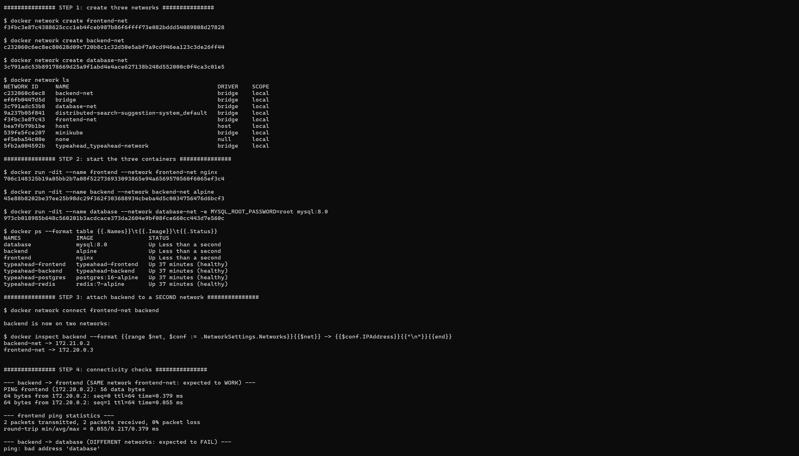
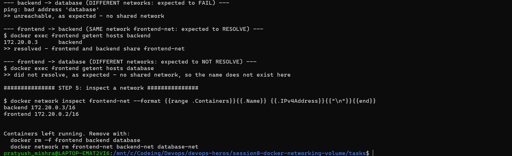
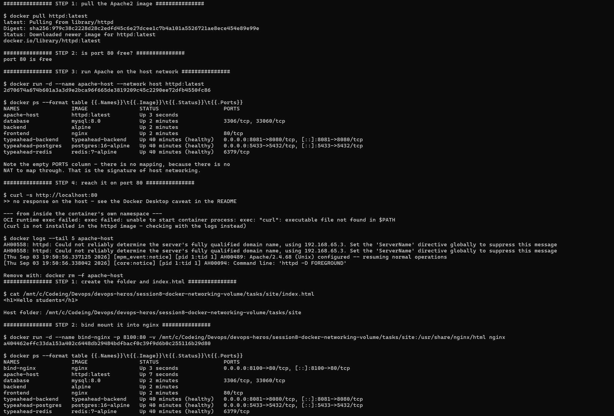
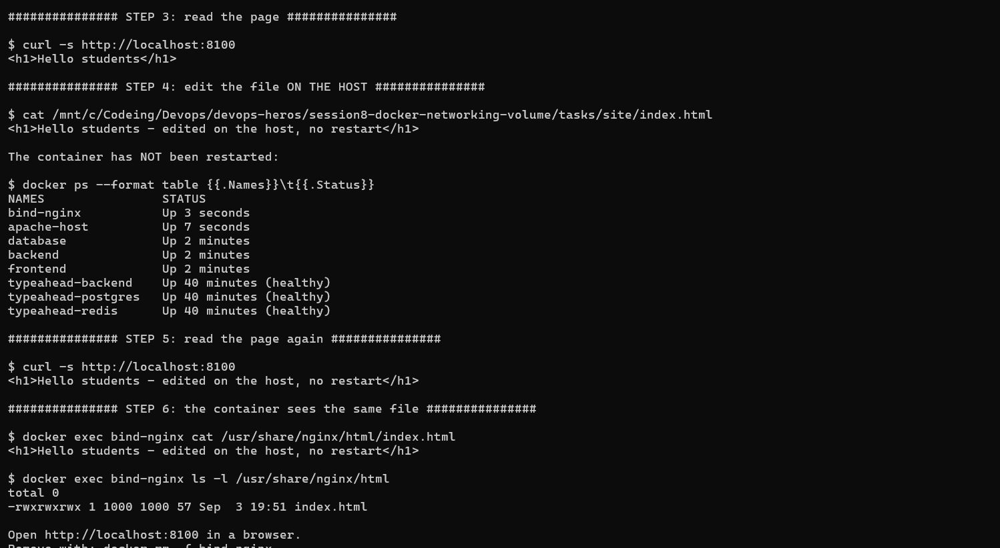

# Session 8 - Docker Networking & Volumes

**Name:** Pratyush Mishra
**Roll Number:** 10486

Ran on Ubuntu 26.04 in WSL2 with Docker Desktop. Two things worth flagging up front: the nginx
image has no `ping`, so the connectivity checks from that container use `getent` instead, and
Task 2 genuinely doesn't load in the browser on Docker Desktop. I've explained why rather than
presenting it as working.

---

## Tasks

### Task 1: Docker Container Networking
- Create 3 containers: Frontend, Backend, Database.
- Use Nginx or Alpine for the frontend and backend.
- Use the MySQL image for the database.
- Create 3 different Docker networks.
- Add the backend container to 2 networks.
- Check connectivity between the containers.

### Task 2: Host Network
- Pull the Apache2 image from Docker Hub.
- Create an Apache2 container using the host network.
- Access the Apache website directly on port 80.

### Task 3: Bind Mount
- Create a folder on the local machine.
- Create an `index.html` file with `Hello students` as the content.
- Bind mount the folder to an Nginx container.
- Access the Nginx website and verify the content.
- Modify `index.html`.
- Verify the change is reflected without restarting the container.

### Task 4: Overlay Network
- Research Docker overlay networks.
- Understand their use cases.
- Understand how overlay networks work across multiple Docker hosts.

```bash
bash task1-networking.sh
bash task2-host-network.sh
bash task3-bind-mount.sh
bash cleanup.sh
```

---

# Task 1 - Docker Container Networking

Three containers, three networks, `backend` attached to two of them.

| Container | Image | Networks |
|---|---|---|
| `frontend` | `nginx` | `frontend-net` |
| `backend` | `alpine` | `backend-net`, then also `frontend-net` |
| `database` | `mysql:8.0` | `database-net` |

## Commands

```bash
docker network create frontend-net
docker network create backend-net
docker network create database-net

docker run -dit --name frontend --network frontend-net nginx
docker run -dit --name backend  --network backend-net  alpine
docker run -dit --name database --network database-net -e MYSQL_ROOT_PASSWORD=root mysql:8.0

docker network connect frontend-net backend      # backend now on two networks
```

`-dit` matters for the alpine container: `-d` detaches, but without `-it` the shell has no
terminal, exits immediately, and the container stops. nginx and mysql run long-lived
foreground processes so they don't need it.

## Connectivity results

| From | To | Shared network? | Test | Result |
|---|---|---|---|---|
| `backend` | `frontend` | yes - `frontend-net` | `ping` | replies |
| `backend` | `database` | no | `ping` | **`bad address 'database'`** |
| `frontend` | `backend` | yes - `frontend-net` | `getent hosts` | resolves |
| `frontend` | `database` | no | `getent hosts` | **doesn't resolve** |

The two tests differ because the images do. `alpine` includes `ping` through busybox; the
`nginx` image ships neither `ping` nor `curl`, so the checks from `frontend` use `getent`, which
is already present. `getent hosts <name>` asks the container's own resolver for the name, which
is what is being tested - a user-defined bridge resolves the names of containers on
that network and no others.

Note what the failure actually looks like: `ping: bad address 'database'`. It isn't a timeout
or an unreachable route - the name doesn't resolve at all, because `database` isn't on any
network `backend` belongs to, so `backend`'s resolver has never heard of it.

That's the main thing this task demonstrates. Containers can reach each other **only** when they
share a network, and `frontend` never gets a route to `database` even though both are running
on the same machine. Putting the middle tier on two networks is how a real three-tier app is
wired: the backend talks to both sides, and the frontend has no path to the database at all.

## Automatic DNS

`ping frontend` works by **name**, not IP. A user-defined bridge network runs an embedded DNS
server that resolves container names to their addresses on that network. The default `bridge`
network doesn't do this - there, containers can only reach each other by IP, which is why
`docker network create` is preferred over the built-in bridge for anything real.

A container on several networks gets **one IP per network**:

```
backend -> backend-net   172.21.0.2
backend -> frontend-net  172.20.0.3
```

Each user-defined network gets its own subnet, so the two addresses sit in different ranges.
`docker network inspect frontend-net` confirms the same thing from the network's side, listing
`frontend` and `backend` as its members and `database` nowhere.

## Output





---

# Task 2 - Host Network

```bash
docker pull httpd:latest
docker run -d --name apache-host --network host httpd:latest
curl http://localhost:80
```

Note there is **no `-p` flag**. That's the defining feature: with `--network host` the
container isn't behind a NAT, so there isn'thing to publish. It binds port 80 on the host
directly. `docker ps` shows an empty `PORTS` column for exactly this reason.

## Bridge vs host

| | Bridge (default) | Host |
|---|---|---|
| Network namespace | its own | shares the host's |
| IP address | private, e.g. `172.17.0.2` | the host's own |
| Reaching a port | must publish with `-p` | already on the host |
| Isolation | container ports hidden unless published | none - binds host ports directly |
| Port conflicts | avoided; many containers can use port 80 internally | two containers can't both take port 80 |
| Performance | one NAT hop | no NAT overhead |

Host networking trades isolation for directness. It is used where the NAT hop is a measurable
cost - high-throughput proxies, or services that need to see real client IPs rather than the
NAT's - and avoided otherwise, because a container that binds host ports directly can collide
with anything else on the machine.

## The Docker Desktop caveat

`--network host` is a **Linux** feature. It works by putting the container in the host's network
namespace, which requires the host to *be* the Linux machine running the containers.

On Docker Desktop for Windows or macOS, containers run inside a Linux VM. "Host" there means
that VM - not Windows. So a host-network container binds port 80 inside the VM, and unless
Docker Desktop's host networking feature is enabled under **Settings → Resources → Network**,
`http://localhost:80` from the Windows browser doesn't reach it.

This matters because the container starts successfully and `docker ps` looks
correct while the page still refuses to load. Nothing has failed; the port simply belongs to a
different network namespace than the browser.

That's what happened in the run below. `curl http://localhost:80` returned nothing,
while the container's own logs show Apache serving normally:

```text
AH00558: httpd: Could not reliably determine the server's fully qualified domain name,
         using 192.168.65.3
[core:notice] AH00094: Command line: 'httpd -D FOREGROUND'
```

`192.168.65.3` is the address of the Docker Desktop Linux VM. Apache bound port 80 on *that*
machine, and it's the reason the request from Windows never arrives - the two are different
hosts, connected only through Docker Desktop's port forwarding, which host networking bypasses
by design.

The `PORTS` column for `apache-host` is empty in `docker ps`, next to `frontend` showing
`80/tcp` and the typeahead containers showing real `->` mappings. That contrast is the clearest
single piece of evidence: a host-network container has no mapping because there's no NAT to
map through.

## Output



---

# Task 3 - Bind Mount

```bash
mkdir site
echo "<h1>Hello students</h1>" > site/index.html

docker run -d --name bind-nginx -p 8100:80 \
    -v "$(pwd)/site:/usr/share/nginx/html" nginx

curl http://localhost:8100          # Hello students

echo "<h1>Hello students - edited on the host</h1>" > site/index.html

curl http://localhost:8100          # the edit, with no restart
```

## What a bind mount is

`-v <host path>:<container path>` mounts a directory from the host straight into the container.
There's no copying involved - both sides are looking at the same files on the same disk. An
edit on the host is visible inside the container immediately, and a write from the container
lands on the host.

The host path must be **absolute**. A relative path is interpreted as a *named volume* instead,
so `-v ./site:/usr/share/nginx/html` silently creates an empty volume called `./site` rather
than mounting the folder - a common and confusing mistake, which is why the script builds the
path with `$(pwd)`.

## Why the change appears without a restart

Nothing is cached. Nginx opens the file from disk on each request, and that file *is* the host's
file. The container was never given a copy to go stale.

Contrast this with `COPY index.html /usr/share/nginx/html/` in a Dockerfile: that copies the
file into an image layer at build time. Changing the host file afterwards has no effect at all
until the image is rebuilt and the container recreated. That's the difference between baking
content in and mounting it.

## Bind mounts vs named volumes

| | Bind mount | Named volume |
|---|---|---|
| Location | a path you choose on the host | managed by Docker under `/var/lib/docker/volumes` |
| Created with | `-v /abs/path:/container/path` | `-v myvolume:/container/path` |
| Host access | ordinary files, edit them directly | through Docker |
| Portable | no - depends on the host's layout | yes |
| Typical use | development: live-editing source or config | production: database storage |

Bind mounts suit development, where the point is to edit files on the host and see the effect
straight away. Named volumes suit persistent data such as a database, where the host layout
should not matter and Docker managing the storage is an advantage.

## Output




---

# Task 4 - Overlay Network

## What it is

An overlay network is a network that spans **multiple Docker hosts**. Containers on different
physical machines join it and talk to each other by name, as though they were all on one
machine. Bridge networks can't do this - a bridge exists only on the host that created it, so
two containers on different machines have no path to each other through it.

Overlay is the default driver for Docker Swarm services and is what makes a multi-node cluster
behave like a single logical network.

## How it works

The mechanism is **VXLAN** - a tunnel that carries layer 2 Ethernet frames inside UDP packets.

1. A container sends a packet to another container by name. The embedded DNS resolves it to an
   overlay IP, e.g. `10.0.0.5`.
2. The sending host's overlay driver wraps that Ethernet frame in a UDP packet (VXLAN
   encapsulation) and sends it across the physical network to the host holding the destination.
3. That host unwraps it and delivers the original frame to the container.

Neither container is aware of any of this. From inside, it looks like an ordinary local network,
even though the packet crossed a real network in between.

Docker keeps the state this needs - which container lives on which host, and the address
allocations - in a distributed key-value store shared by the cluster. In Swarm mode that store
is built in and managed by the manager nodes.

Ports the hosts must have open between them:

| Port | Protocol | Purpose |
|---|---|---|
| `2377` | TCP | cluster management (Swarm managers) |
| `7946` | TCP + UDP | node discovery and gossip between nodes |
| `4789` | UDP | the VXLAN data path itself |

## Use cases

- **Multi-host container communication** - the core case. Services on different machines
  addressing each other by name.
- **Docker Swarm services** - a service scaled across nodes is placed on an overlay network, and
  Swarm's built-in load balancing distributes requests across its replicas.
- **Microservices spread over a cluster** - each service reaches the others by name, with no
  hard-coded IPs and no reconfiguration when a container moves to a different host.
- **Isolation within a cluster** - several overlay networks can carve a cluster into segments,
  the same way separate bridge networks isolate tiers on one host in Task 1.
- **Encrypted traffic between hosts** - `--opt encrypted` turns on IPsec for the VXLAN tunnel,
  which matters when the physical network between hosts isn't trusted.

```bash
docker swarm init                                    # create a single-node swarm
docker network create --driver overlay my-overlay    # overlay needs swarm mode
docker network create --driver overlay --attachable my-overlay   # also usable by plain containers
docker service create --network my-overlay --replicas 3 --name web nginx
```

Without `--attachable`, an overlay network can only be used by Swarm *services*, not by
containers started with `docker run`.

## Overlay compared with the other drivers

| Driver | Scope | Use |
|---|---|---|
| `bridge` | single host | the default; containers on one machine (Task 1) |
| `host` | single host | no isolation, container shares the host's namespace (Task 2) |
| `overlay` | **multiple hosts** | Swarm services, cross-host communication |
| `macvlan` | single host | gives a container its own MAC and an IP on the physical LAN |
| `none` | single host | no networking at all |
